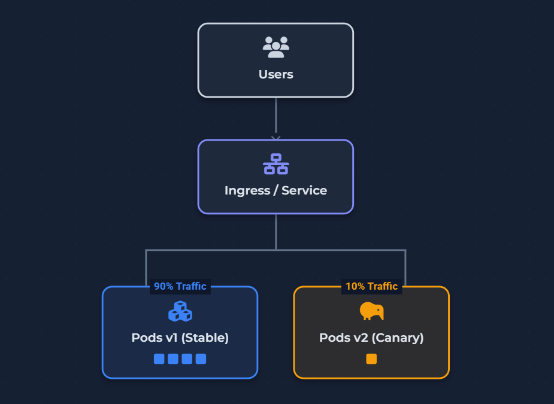

# 🚀 Canary Deployment in Kubernetes

In this lab, we implement a **Canary Deployment** strategy. Unlike Blue-Green, where you switch traffic all at once, a Canary release introduces the new version to a small subset of users (e.g., 10%) before rolling it out to the entire cluster.

We simulate traffic split using replicas and understand how gradual rollout and rollback works in real environments.

---

## 🎯 Architecture Overview



---

## 🎥 Video Tutorial

Watch the step-by-step implementation and theory:

👉 [**Watch the Lab 10 Tutorial**](https://youtu.be/b8KIEIkV9zI?si=w06ofQDdoDTL1K17)

---

## 📘 Topics Covered

* **The "Canary" Concept:** Why gradual releases reduce production risk.
* **Traffic Splitting:** How Kubernetes uses replica ratios (9:1) to simulate traffic percentage.
* **Monitoring & Validation:** Observing real user impact before scaling.
* **Manual Rollback:** Quickly reverting to the stable version if the canary fails.
* **Limitations:** Understanding why standard Kubernetes Services provide "approximate" rather than "exact" traffic splitting.

---

## 🧪 Lab Steps (High-Level)

1️⃣ Deploy v1 (stable version)  
2️⃣ Create Service  
3️⃣ Deploy v2 (canary version)  
4️⃣ Observe traffic behavior  
5️⃣ Increase traffic to v2  
6️⃣ Perform full rollout  
7️⃣ Rollback if needed  

---
## 📂 Lab Files

| File | Description |
| :--- | :--- |
| [**commands.md**](./commands.md) | Full sequence of commands for the demo |
| [**v1-deployment.yaml**](./v1-deployment.yaml) | Stable version (9 replicas) |
| [**v2-deployment.yaml**](./v2-deployment.yaml) | Canary version (1 replica) |
| [**service.yaml**](./service.yaml) | Shared NodePort service for both versions |

---
---

## 📁 Folder Structure

```bash
09-kubernetes-canary-deployment/
 ├── README.md
 ├── commands.md
 ├── v1-deployment.yaml
 ├── v2-deployment.yaml
 ├── service.yaml
 └── assets/
      └── canary-deployment-thumbnail.png
```

---

## 🧠 Key Concept

Kubernetes does **NOT** split traffic by percentage.  
Traffic is distributed based on **number of pods**, so results are approximate.

---

## 🎯 Learning Results

After completing this lab, you will understand:
1. How to run two versions of the same app simultaneously using shared labels.
2. How to achieve a **90/10 traffic split** using pod scaling.
3. How to perform a zero-downtime transition from V1 to V2.
---

⭐ If you find this helpful, consider starring the repo!
---

[⬅️ Previous](../09-blue-green-kubernetes-demo) | [🏠 Home](../README.md) | [Next Lab: Deployment Comparison ➡️](../11-deployment-strategies-comparison)
