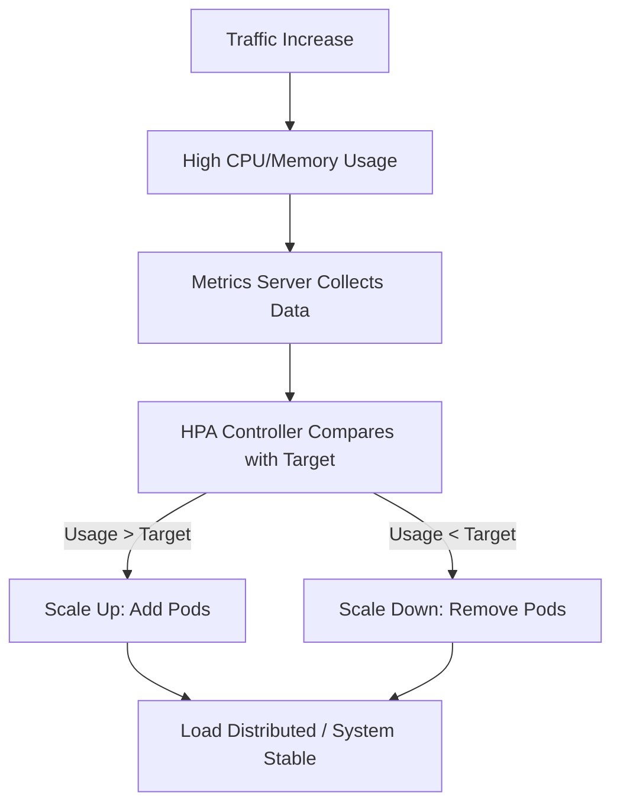

# 📈 Lab 14: Horizontal Pod Autoscaler (HPA)

Horizontal Pod Autoscaler (HPA) automatically scales the number of Pods in a replication controller, deployment, replica set, or stateful set based on observed CPU utilization (or other metrics).

---

## 🎥 Video Tutorial

Watch the full HPA explanation and hands-on scaling demo:

👉 [**Kubernetes HPA Deep Dive | Auto-Scaling in Action**](https://youtu.be/VLqjrlxp6Bk?si=qONETHQzgULKEhEy) 
---

## 📘 How HPA Works

The HPA controller operates on a control loop. It periodically queries the resource utilization against the metrics specified in each HorizontalPodAutoscaler definition.

### 🗺️ HPA Workflow Diagram

---

## 🚀 Lab Objectives
1. Install and configure **Metrics Server** (with `insecure-tls` for labs).
2. Deploy an application with **Resource Requests** (Essential for HPA).
3. Configure HPA with Min/Max replicas and Target CPU %.
4. Perform a **Load Test** to trigger an automatic scale-up.
5. Observe the **Scale-down** cooldown period.

---

## 📂 Lab Files

| File | Description |
| :--- | :--- |
| [**commands.md**](./commands.md) | Step-by-step terminal commands for the demo |
| [**hpa-demo-deployment.yaml**](./hpa-demo-deployment.yaml) | Deployment with CPU requests/limits |
| [**hpa-definition.yaml**](./hpa-definition.yaml) | The HPA resource defining scaling logic |

---

## ⭐ Production Best Practices
*   **Always Set Requests:** HPA cannot calculate percentage utilization without `resources.requests.cpu`.
*   **Metrics Server is Mandatory:** Ensure it is healthy before troubleshooting HPA.
*   **Cooldown Period:** Be aware that scale-down has a default delay (usually 5 mins) to prevent "flapping" (rapidly adding/removing pods).
*   **Avoid Manual Scaling:** Once HPA is managed for a deployment, do not use `kubectl scale`.

---

[⬅️ Previous](../13-kubernetes-rbac) | [🏠 Home](../README.md) | [Next Lab: Control Plane Internals ➡️](../15-control-plane-internals)
