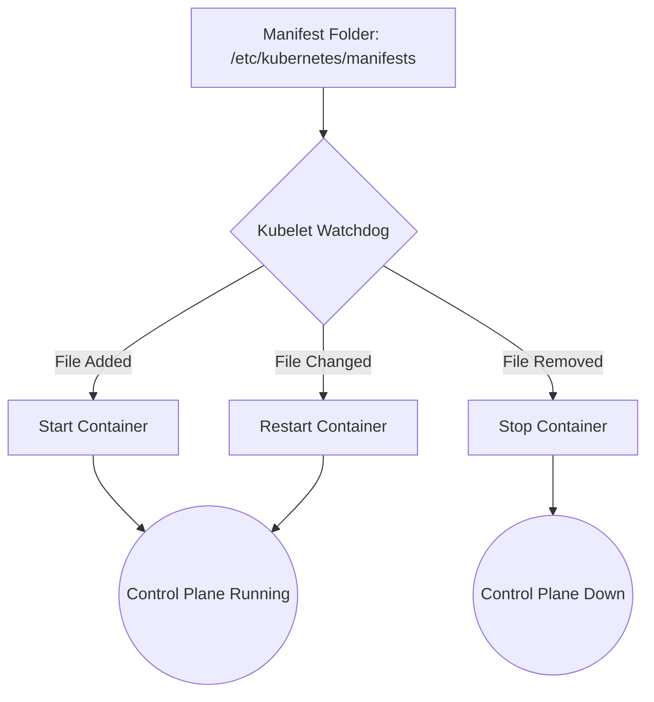

# 🏗️ Lab 15: Kubernetes Control Plane Internals & Debugging

What do you do when `kubectl` stops responding? This lab explores the "Static Pod" mechanism that powers the Kubernetes Control Plane and teaches you how to debug the cluster from the OS level.

---

## 🎥 Video Tutorial

Watch the full deep-dive into Static Pods and Control Plane recovery:

👉 [**Kubernetes Control Plane Internals | kubectl Not Working?**](https://youtu.be/J7YpTMIVtpI?si=fWw7F0wlh9TRG8Fs) 

---

## 📘 Core Architecture: Static Pods

Control plane components (API Server, Scheduler, Controller Manager, and etcd) do not run as regular pods managed by the API Server. Instead, they are **Static Pods**.

### 🗺️ The Kubelet Watchdog Flow

---

## 🚀 Lab Objectives
1. Explore the **Static Pod Manifest** directory.
2. Understand why the **Kubelet** is the most important service on a master node.
3. Simulate a **Total Control Plane Failure** by removing the API Server manifest.
4. Debug the cluster using **crictl** and **journalctl** (without using kubectl).
5. Restore the cluster using the Watchdog mechanism.

---

## 📂 Lab Files

| File | Description |
| :--- | :--- |
| [**troubleshooting-guide.md**](./troubleshooting-guide.md) | Emergency commands when kubectl is down |
| [**static-pod-manifests.md**](./static-pod-manifests.md) | Breakdown of kube-apiserver.yaml flags |

---

## 🧠 Key Takeaways
*   **The Hub:** Everything (Scheduler, Kubelet, etc.) talks *only* to the API Server.
*   **The Brain vs Memory:** API Server is the brain; `etcd` is the memory. If the memory is gone, the brain can't function.
*   **Independence:** The Kubelet can run and manage containers even if the API Server is completely offline.

---
| [« Lab 14: HPA Auto-Scaling](../14-hpa-autoscaling/README.md) | [Main Directory](https://github.com/Sagar-CloudNative/kubernetes-kubeadm-labs) | [Next: Lab 16 »](../../) |
| :--- | :---: | ---: |
